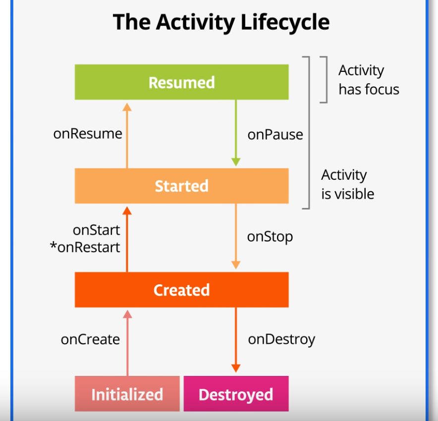

# Android Activity Lifecycle

Upon the navigation of an app from firing it up, using it to quitting the app, the **activity** instance in the app transitions through various states in it's lifecycle.

Via callbacks in the **Activity** class, the activity knows about the state change.

Within the callbacks, we can declare how an activity behaves.

The android activity lifecycle has the following states:

  * Initialized
  * Created
  * Started
  * Resumed
  * Destroyed

In creating performant apps, it is important to use the activities correctly so that the app is:
  
  * reliant when switching to another app
  * able to stop comsuming valuable memory resources
  * able to save user's progress/session and be able to resume it.

